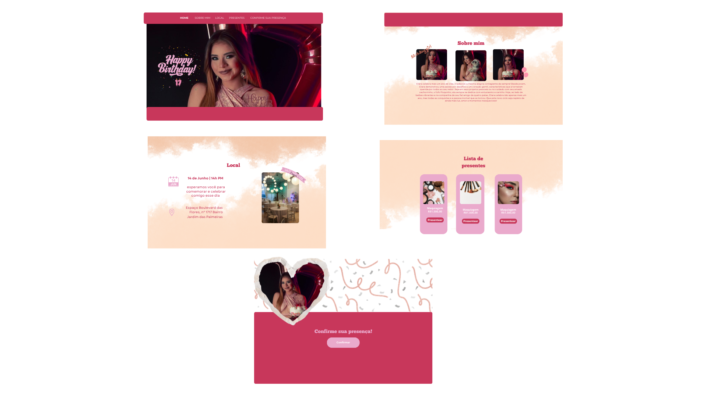

# Celebra Site

Este projeto foi desenvolvido para compartilhar informações importantes sobre eventos, facilitar a confirmação de presença e ajudar na organização. O tema principal é um aniversário mas o site pode se adaptar a diversos eventos.

## 📲 Sobre o Projeto

O objetivo do site é oferecer uma experiência acolhedora e prática para nossos convidados do evento. Através dele é possível:

- 📍 Visualizar o local e horário
- 🧾 Conhecer sobre o evento
- 🎁 Escolher presentes
- ✅ Confirmar presença de forma simples via formulário
- 📆 Acompanhar a contagem regressiva

obs: A lógica de algumas  funcionalidades foram implementadas mas sem redirecionar a um destino, pois se trata de um site fictício. 

## 🛠️ Tecnologias Utilizadas

O site foi desenvolvido utilizando:

- **HTML5** – Estrutura e semântica das páginas
- **CSS3** – Estilização e responsividade
- **JavaScript** – Interatividade e manipulação do DOM

## 🚀 Funcionalidades

- ✅ Navegação dinâmica entre seções
- ✅ Menu recolhido com sidebar em dispositivos móveis
- ✅ Contagem regressiva em tempo real até o evento
- ✅ Responsividade para celular e desktop
- ✅ Formulário externo de RSVP via Google Forms
- ✅ Integração com Google Maps
- ✅ Confirmação de presente via botão com redirecionamento para o WhatsApp

## 📂 Estrutura do Repositório

```plaintext
📁 CelebraSite
 ├── 📂 imagens/              # Imagens usadas no site
 │   ├── fotos/
 │   ├── png/
 ├── 📂 Prototipo/            # Imagens do layout do protótipo
 │   ├── escopo.png/
 └── 📜 doc.md             # Documentação
 ├── 📜 index.html             # Página principal
 ├── 📜 script.js             # Scripts para interatividade
 ├── 📜 style.css             # Estilização global

```

## 🎨 Capturas de Tela

Demonstração, aparência e usabilidade do site.





## 🔧 Como Executar o Projeto

1. Clone este repositório:
   ```bash
   git clone https://github.com/janinealvess/CelebraSite.git
   ```
2. Acesse a pasta do projeto:
   ```bash
   cd CelebraSite
   ```
3. Abra o arquivo `index.html` no navegador.


## 🧠 Aprendizados

Durante o desenvolvimento, foram praticados diversos conceitos importantes de Web:

- Manipulação do DOM com JavaScript puro
- Eventos e funções para navegação por seções
- Implementação de responsividade com media Queries
- Boas práticas de organização de arquivos
- Integração com serviços externos (Google Forms, Maps, WhatsApp)


## 📲 Acessibilidade e Performance
O site já considera boas práticas como:

- Uso de cores com bom contraste
- Fonte legível e espaçamento adequado
- Layout adaptável a diferentes tamanhos de tela
- Tamanhos de botão adequados para toque

## 📞 Contato

Caso tenha dúvidas ou sugestões, sinta-se à vontade para entrar em contato!

#### **Contato:** [janinealves.developer@gmail.com](mailto\:janinealves.developer@gmail.com) 
#### **Instagram:** @janinealves.s
---

**Desenvolvido por Janine Alves**


